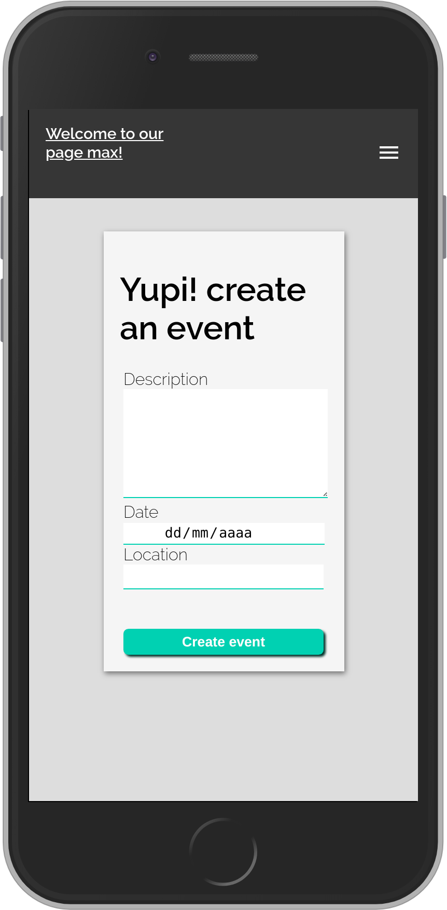

[![Contributors][contributors-shield]][contributors-url]
[![Forks][forks-shield]][forks-url]
[![Stargazers][stars-shield]][stars-url]
[![Issues][issues-shield]][issues-url]
[![LinkedIn][linkedin-shield]][linkedin-url]
[![LinkedIn][linkedin-shield2]][linkedin-url2]

<!-- PROJECT LOGO -->
 

  <h2 align="center"> Private Events</h2>
  

     A webpage that manage user signups, and each user can create events and invite other users to them. Events take place at a specific date and at a location and then are classified by "upcomming events" and "past events". We made use of ActiveRecord’s associations in depth.
     
    <a href="https://github.com/kitpao/private-events"><strong>Explore the docs »</strong></a>
     
     
    <a href="https://github.com/kitpao/private-events">View Demo</a>
    ·
    <a href="https://github.com/kitpao/private-events/issues">Report Bug</a>
    ·
    <a href="https://github.com/kitpao/private-events/issues">Request Feature</a>
  

## Table of Contents
* [About the Project](#about-the-project)
  * [Built With](#built-with)
* [Instalation guide](#instalation-guide)
* [Roadmap](#roadmap)
* [Contact](#contact)
* [Acknowledgements](#acknowledgements)
<!-- ABOUT THE PROJECT -->

## About The Project
<em>Click on the image to visit the live version!</em>
[![Product Name Screen Shot][product-screenshot]](https://floating-chamber-00036.herokuapp.com/)

In this project we planned all the associations needed for the funtionality: 
* User can log in, or sign up if the user doesn't exist
* User can create events, each field in the forms has validations
* A user can invite another user only to his/her event
* User can attend many events only if they are invited to them
* The user's events show up in the user profile page separated by upcomming events and past events 

Other features of the project:
* Images for the events are random, they change when you update
* CSS styles created from scratch
* Show flash messages for feedback (For example, when you already invited that user to your event, it notifies you)
* Validates that users don't repeat, case insensitive
* When the user tries to login in and his account doesn't exists, it redirect to the sign_up form
* Responsive interface:

### Built With
The project was developed using the following technologies:
- [RUBY](https://www.ruby-lang.org/es/)
- [RUBOCOP LINTERN](https://github.com/microverseinc/linters-config/tree/master/ruby)
- [RAILS](https://rubyonrails.org/)

## Instalation Guide
Click on the following [link](https://gitpod.io/github.com/kitpao/private-events/tree/associations),

* Wait for the workspace to load and then click on the terminal, type `bundle install` and hit enter to install gems
* Then `yarn install --check-files` and hit enter
* Run `rails db:migrate` and hit enter
* Run `rails c` and hit enter to interact with the objects in the console (User, Event, Invitation: see the schema for more information)

-> or see the direct page working on https://floating-chamber-00036.herokuapp.com/ and you can test it directly in the browser!!

## Roadmap

See the [open issues](https://github.com/kitpao/private-events/issues) for a list of proposed features (and known issues).

## Contact

  Project Link: [https://github.com/kitpao/private-events](https://github.com/kitpao/private-events)

  Kitzia Paola Vidal Marroquin - [Github user: kitpao](https://github.com/kitpao)

    <a target="_blank" href="https://mail.google.com/mail/?view=cm&fs=1&tf=1&to=kitpao91@gmail.com">
      kitpao91@gmail.com
    </a> &nbsp; |
    <a target="_blank" href="https://github.com/kitpao/Personal_Projects">
        Portfolio
    </a> &nbsp; |
    <a target="_blank" href="https://www.linkedin.com/in/kitzia-paola-vidal/">
      LinkedIn
    </a> &nbsp; |
    <a target="_blank" href="https://twitter.com/Kitpao1">
      Twitter
    </a>

  Jesus Eduardo Cruz Valdez - [EdCrux](https://github.com/EdCrux
)

    <a target="_blank" href="https://mail.google.com/mail/?view=cm&fs=1&tf=1&to=jecruxiz@gmail.com
">
      jecruxiz@gmail.com
    </a> &nbsp; |
    <a target="_blank" href="https://github.com/EdCrux?tab=repositories">
        My Repositories
    </a> &nbsp; |
    <a target="_blank" href="www.linkedin.com/in/edcrux">
      LinkedIn
    </a> &nbsp; |
    <a target="_blank" href="https://twitter.com/edcrux8">
      Twitter
    </a>

## Acknowledgements
- [Microverse curriculum Rails section](https://www.microverse.org/?grsf=6ns691)
- [The Odin project: Associations](https://www.theodinproject.com/courses/ruby-on-rails/lessons/associations)
- [Rails Guides](https://guides.rubyonrails.org)

<!-- MARKDOWN LINKS & IMAGES -->
[contributors-shield]: https://img.shields.io/github/contributors/kitpao/private-events.svg?style=flat-square
[contributors-url]: https://github.com/kitpao/private-events/graphs/contributors
[forks-shield]: https://img.shields.io/github/forks/kitpao/private-events.svg?style=flat-square
[forks-url]: https://github.com/kitpao/private-events/network/members
[stars-shield]: https://img.shields.io/github/stars/kitpao/private-events.svg?style=flat-square
[stars-url]: https://github.com/kitpao/private-events/stargazers
[issues-shield]: https://img.shields.io/github/issues/kitpao/private-events.svg?style=flat-square
[issues-url]: https://github.com/kitpao/private-events/issues
[license-shield]: https://img.shields.io/github/license/kitpao/private-events.svg?style=flat-square
[license-url]: https://github.com/kitpao/private-events/blob/master/LICENSE.txt
[linkedin-shield]: https://img.shields.io/badge/-LinkedIn-black.svg?style=flat-square&logo=linkedin&colorB=555
[linkedin-url]: https://www.linkedin.com/in/kitzia-paola-vidal/
[linkedin-shield2]: https://img.shields.io/badge/-LinkedIn-black.svg?style=flat-square&logo=linkedin&colorB=555
[linkedin-url2]: https://www.linkedin.com/in/edcrux/
[product-screenshot]: app/assets/images/desktop.png
[mobile]: app/assets/images/phone.png
